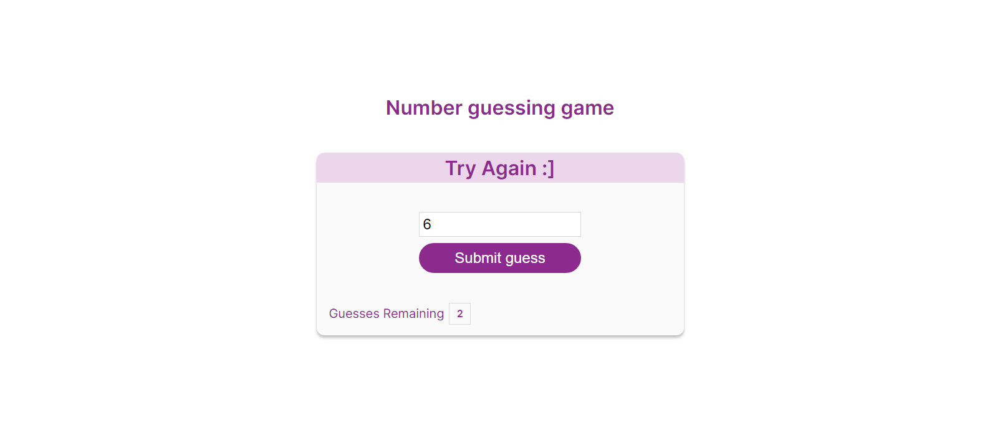

# Guess Number Game
This program allows the user to play by guessing numbers from 0 to 10  and the user has only 3 chances to enter the number then after that the user will lose the game.

Live Demo: https://guess-number-pearl.vercel.app/
Figma Design: https://www.figma.com/file/vmI9cyCSZK6kcH3HpToTEE/Untitled?node-id=0%3A1&t=5JmlLZda8QdBfygL-1

# Technologies used
- Html
- Css
- Javascript

### Made with :heart: 
